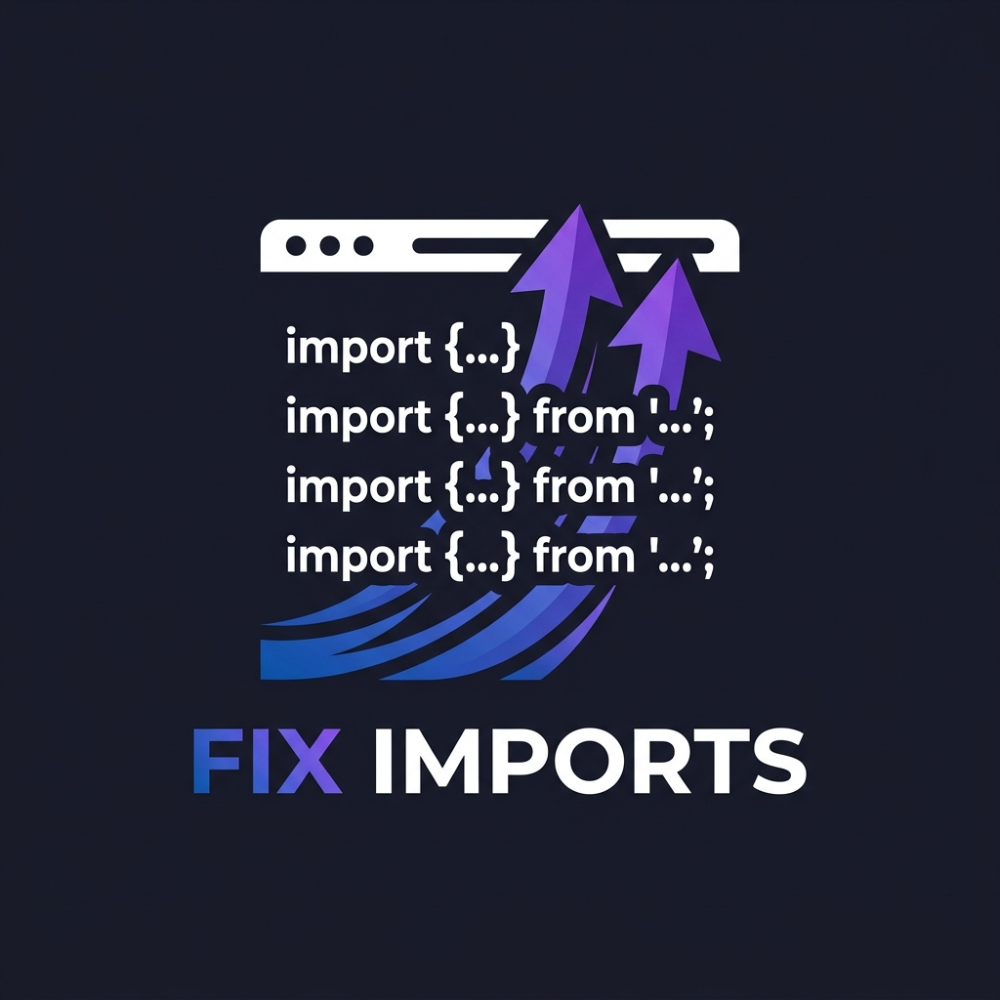

# Fix Imports for Visual Studio Code

[](https://marketplace.visualstudio.com/items?itemName=antigravity.fix-imports)
[](https://open-vsx.org/extension/antigravity/fix-imports)
[](LICENSE)

**Fix Imports** is a fast, AST-powered VS Code extension that detects import statements misplaced inside functions, loops, or logical blocks and cleanly moves them up to the top header block.

Built with **`web-tree-sitter` (WebAssembly)**, it runs natively inside the editor host with **zero external subprocesses**, **zero regex fragility**, and **instant execution**.

---

## ✨ Key Features

- 🌳 **Real AST-Based Detection**: Uses WebAssembly tree-sitter grammars to understand the exact abstract syntax tree of your code.
- 🧠 **Understands Deliberate Conditional Imports**:
  - Automatically preserves fallback patterns like:
    ```python
    try:
        import ujson as json
    except (ImportError, ModuleNotFoundError):
        import json
    ```
  - Preserves typing guards like `if TYPE_CHECKING:` and version checks `if sys.version_info >= (3, 10):`.
- 🛡️ **Syntax-Safe Python Refactoring**:
  - If moving an import would leave a Python block (`try`, `if`, `def`) empty, it automatically inserts an indented `pass` statement to prevent `IndentationError` / syntax errors.
- 🎯 **Header Insertion Intelligence**:
  - **Python**: Strictly respects shebang lines (`#!/usr/bin/env python3`), encoding cookies, module docstrings (`"""..."""`), and keeps `from __future__ import ...` statements above all other imports.
  - **TypeScript / JavaScript**: Strictly preserves shebangs, license banners, and directives (`"use client";`, `"use server";`, `"use strict";`).
- ⚡ **Extensible Multi-Language Architecture**: Built with a plug-in parser interface. Adding a new language simply requires registering a new `LanguageParser` module.
- 🔍 **Selection & Whole-File Support**:
  - Select any block of code and fix only imports inside that selection.
  - Or run on the whole file with a single shortcut or right-click.
- 💡 **Inline Quick Fixes & Diagnostics**: Subtle warning squiggles on misplaced imports with one-click Quick Fix (`Ctrl+.` or `Cmd+.`).
- 🚀 **Dual Registry Publishing**: Published to both the **VS Code Marketplace** and **Open VSX**.

---

## 🚀 How to Use

### 1. Right-Click Context Menu
Select code (or right-click anywhere in the editor) and click **Fix Imports**:



### 2. Keyboard Shortcut
Press `Ctrl+Alt+I` (Windows/Linux) or `Cmd+Alt+I` (macOS) to fix imports instantly.

### 3. Command Palette
Open the Command Palette (`Ctrl+Shift+P` / `Cmd+Shift+P`) and choose:
- `Fix Imports: Fix Imports` (operates on current selection or whole file)
- `Fix Imports: Fix All Imports in File`

### 4. Quick Fix (Code Action)
Hover over any yellow warning squiggle on a misplaced import and press `Cmd+.` / `Ctrl+.`:
- **Fix Import: Move to top of file**
- **Fix all misplaced imports in file**

---

## ⚙️ Configuration (`settings.json`)

Configure Fix Imports under the `fixImports` namespace in your user or workspace settings:

```jsonc
{
  // Module names, symbols, or condition keywords that indicate intentional conditional imports to preserve
  "fixImports.preserveConditionalImports": [
    "typing",
    "TYPE_CHECKING",
    "sys.version_info",
    "sys.platform"
  ],

  // Automatically sort moved imports alphabetically at the top header
  "fixImports.sortImportsAfterMove": true,

  // Group imports by origin (stdlib, third-party, local) when inserting at the top
  "fixImports.groupByOrigin": true,

  // Display warning squiggles and quick fixes on misplaced imports
  "fixImports.enableDiagnostics": true,

  // Insert 'pass' in Python blocks that would otherwise become empty after moving imports
  "fixImports.python.insertPassOnEmptyBlock": true
}
```

---

## 🧩 Supported Languages

| Language | AST Parser | Fallback Support |
|---|---|---|
| **Python** (`.py`) | `tree-sitter-python.wasm` | Full AST, deliberate conditional detection, `pass` injection |
| **TypeScript** (`.ts`, `.tsx`) | `tree-sitter-typescript.wasm` | Full AST, ES imports, CommonJS `require()` |
| **JavaScript** (`.js`, `.jsx`) | `tree-sitter-typescript.wasm` | Full AST, ES imports, CommonJS `require()` |
| **Other Languages** | `RegexFallbackParser` | Line-by-line fallback when no AST grammar is registered |

---

## 🏗️ Architecture

```
fix-imports/
├── src/
│   ├── extension.ts          # Activation, commands, CodeActions, and Diagnostics
│   ├── core/
│   │   ├── ImportFixer.ts    # Orchestrator — calls language parser & applies edits
│   │   ├── EditPlanner.ts    # Turns imports into atomic VS Code TextEdits
│   │   └── types.ts          # Core interfaces (FoundImport, InsertionPoint, Config)
│   ├── parsers/
│   │   ├── LanguageParser.ts # Common interface for all language parsers
│   │   ├── PythonParser.ts   # Tree-sitter Python AST parser
│   │   ├── TypeScriptParser.ts # Tree-sitter JS/TS AST parser
│   │   ├── RegexFallbackParser.ts # Last-resort fallback parser
│   │   └── index.ts          # Central parser registry & WASM manager
│   ├── config/
│   │   └── settings.ts       # Settings reader with defaults
│   └── ui/
│       ├── CodeActions.ts    # CodeActionProvider for inline Quick Fixes
│       └── Diagnostics.ts   # DiagnosticCollection with debounced reporting
├── dist/
│   ├── extension.js          # High-performance bundled extension bundle
│   └── wasm/                 # Tree-sitter WebAssembly binaries
├── test/                     # Unit test suites (Python, TypeScript, EditPlanner)
└── .github/workflows/        # CI/CD test and dual marketplace release workflows
```

---

## 📦 Building & Publishing

### Build Locally
```bash
npm install
npm run build
npm test
```

### Package Extension (.vsix)
```bash
npm run package
```
This produces `fix-imports-<version>.vsix`.

### Publish to VS Code Marketplace & Open VSX
Automated on git tag push `v*.*.*` via `.github/workflows/publish.yml`, or locally via:
```bash
npm run publish:marketplace
npm run publish:openvsx
```

---

## 📄 License

MIT © Tanmoy Debnath
